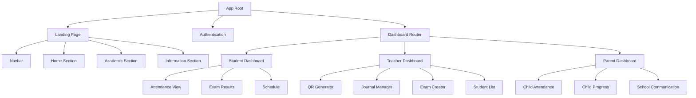
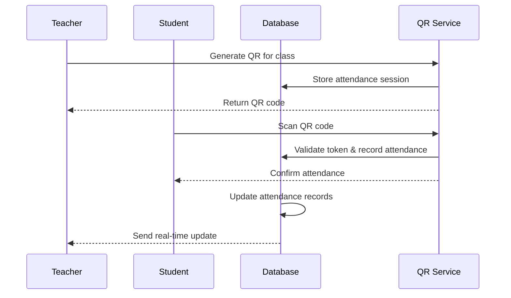
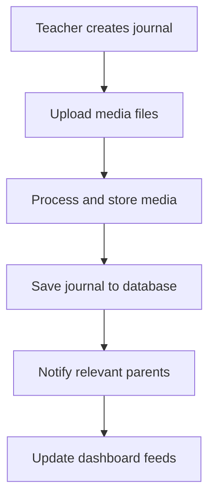
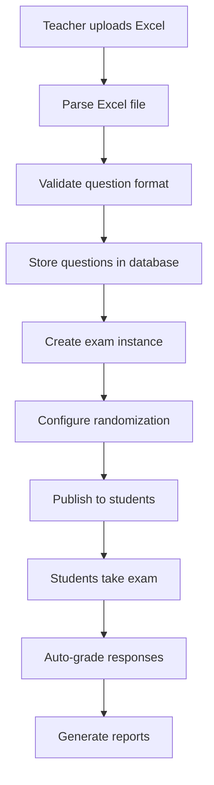
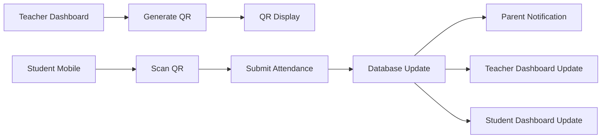
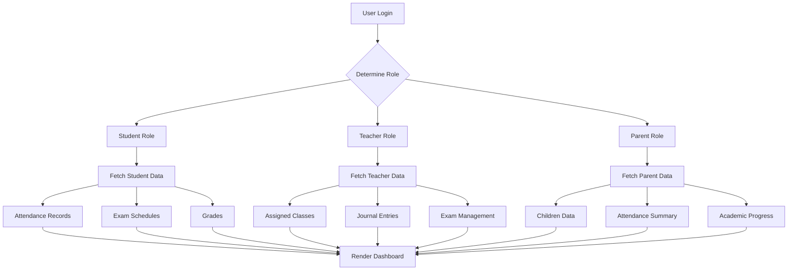
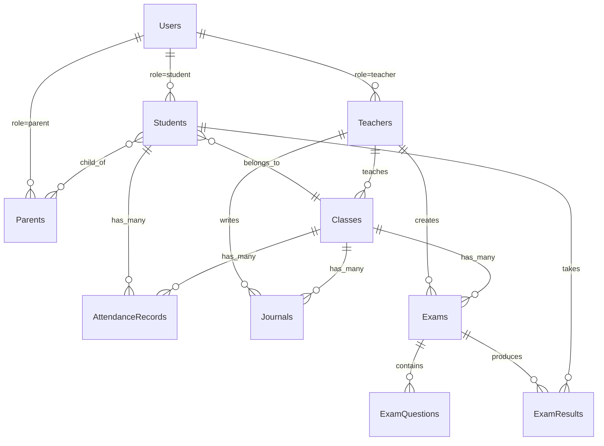

# NETSA School Management System Design

## Overview

**NETSA (New Era Technology School Administration)** is a comprehensive school management prototype built on the existing netsa framework (HyperExpress + Svelte 5 + Inertia.js). The system provides role-based dashboards, QR code attendance tracking, teacher journals, and automated exam management.

### Core Features
- Multi-role dashboards (Student, Teacher, Parent)
- QR code-based attendance system
- School landing page with navigation
- Teacher journal with media uploads
- Excel-based exam system with question randomization

### Technology Stack
- **Backend**: HyperExpress, TypeScript, Knex, SQLite
- **Frontend**: Svelte 5, Inertia.js, TailwindCSS
- **Additional Libraries**: qrcode, xlsx, multer, moment.js

## Frontend Architecture

### Component Hierarchy



### Component Definitions

| Component | Purpose | Props | State Management |
|-----------|---------|-------|------------------|
| `LandingPage.svelte` | School website home | - | Static content |
| `DashboardStudent.svelte` | Student portal | `user: Student` | Attendance, grades |
| `DashboardTeacher.svelte` | Teacher portal | `user: Teacher` | Classes, students |
| `DashboardParent.svelte` | Parent portal | `user: Parent` | Children data |
| `AttendanceScanner.svelte` | QR code scanner | `class_id: string` | Camera, scanner |
| `QRGenerator.svelte` | QR code creator | `attendance_id: string` | QR display |
| `TeacherJournal.svelte` | Journal management | `journal_id?: string` | Form, media upload |
| `ExamManager.svelte` | Exam system | `exam_id?: string` | Excel upload, questions |

### Routing & Navigation

```typescript
// routes/web.ts extension
const routes = {
  // Landing page
  '/': 'LandingPage',
  '/academic': 'LandingPage#academic',
  '/information': 'LandingPage#information',
  
  // Authentication
  '/login': 'Login',
  '/register': 'Register',
  
  // Role-based dashboards
  '/dashboard/student': 'DashboardStudent',
  '/dashboard/teacher': 'DashboardTeacher',
  '/dashboard/parent': 'DashboardParent',
  
  // Feature routes
  '/attendance/scan': 'AttendanceScanner',
  '/journal/:id?': 'TeacherJournal',
  '/exam/:id?': 'ExamManager'
}
```

### State Management

**Inertia.js Shared Data Pattern**:
```typescript
// Shared across all pages
interface SharedProps {
  user: User & { role: 'student' | 'teacher' | 'parent' }
  flash: { success?: string, error?: string }
  permissions: string[]
}

// Role-specific data
interface StudentData {
  attendance_summary: AttendanceRecord[]
  upcoming_exams: Exam[]
  recent_grades: Grade[]
}

interface TeacherData {
  classes: Class[]
  pending_journals: Journal[]
  active_exams: Exam[]
}

interface ParentData {
  children: Student[]
  notifications: Notification[]
}
```

## Backend Architecture

### API Endpoints Reference

#### Authentication & User Management
| Method | Endpoint | Purpose | Auth Required |
|--------|----------|---------|---------------|
| POST | `/auth/login` | User authentication | No |
| POST | `/auth/register` | User registration | No |
| GET | `/auth/user` | Current user data | Yes |
| POST | `/auth/logout` | User logout | Yes |

#### Attendance System
| Method | Endpoint | Purpose | Auth Required |
|--------|----------|---------|---------------|
| POST | `/attendance/generate-qr` | Generate QR for class | Teacher |
| POST | `/attendance/scan` | Submit attendance scan | Student |
| GET | `/attendance/class/:id` | Class attendance list | Teacher |
| GET | `/attendance/student/:id` | Student attendance history | Student/Parent |

#### Journal Management
| Method | Endpoint | Purpose | Auth Required |
|--------|----------|---------|---------------|
| GET | `/journal/teacher/:id` | Teacher's journals | Teacher |
| POST | `/journal` | Create journal entry | Teacher |
| PUT | `/journal/:id` | Update journal entry | Teacher |
| POST | `/journal/:id/upload` | Upload journal media | Teacher |

#### Exam System
| Method | Endpoint | Purpose | Auth Required |
|--------|----------|---------|---------------|
| POST | `/exam/import-excel` | Import questions from Excel | Teacher |
| POST | `/exam/create` | Create new exam | Teacher |
| GET | `/exam/student/:id` | Student's available exams | Student |
| POST | `/exam/submit` | Submit exam answers | Student |

### Data Models & ORM Mapping

```typescript
// Extended User model
interface User {
  id: string
  email: string
  name: string
  role: 'student' | 'teacher' | 'parent' | 'admin'
  profile_image?: string
  created_at: Date
  updated_at: Date
}

// School-specific models
interface Student extends User {
  student_id: string
  class_id: string
  parent_ids: string[]
  admission_date: Date
}

interface Teacher extends User {
  teacher_id: string
  subject_specializations: string[]
  assigned_classes: string[]
}

interface Parent extends User {
  children_ids: string[]
  emergency_contact: string
}

interface AttendanceRecord {
  id: string
  student_id: string
  class_id: string
  teacher_id: string
  date: Date
  status: 'present' | 'absent' | 'late'
  scanned_at?: Date
  qr_token: string
}

interface Journal {
  id: string
  teacher_id: string
  class_id: string
  title: string
  content: string
  media_urls: string[]
  date: Date
  created_at: Date
}

interface Exam {
  id: string
  teacher_id: string
  class_id: string
  title: string
  questions: ExamQuestion[]
  duration_minutes: number
  randomize_questions: boolean
  start_time: Date
  end_time: Date
}

interface ExamQuestion {
  id: string
  question_text: string
  options: string[]
  correct_answer: number
  points: number
}
```

### Business Logic Layer

#### Attendance Service Architecture


#### Journal Management Flow


#### Exam System Flow


### Service Layer Extensions

```typescript
// app/services/AttendanceService.ts
class AttendanceService {
  generateQRToken(class_id: string, teacher_id: string): Promise<string>
  validateQRScan(token: string, student_id: string): Promise<boolean>
  getClassAttendance(class_id: string, date: Date): Promise<AttendanceRecord[]>
  getStudentAttendanceHistory(student_id: string): Promise<AttendanceRecord[]>
}

// app/services/ExcelService.ts
class ExcelService {
  parseExamQuestions(file: Buffer): Promise<ExamQuestion[]>
  validateQuestionFormat(questions: any[]): boolean
  exportAttendanceReport(class_id: string, date_range: DateRange): Promise<Buffer>
}

// app/services/JournalService.ts
class JournalService {
  createJournal(data: CreateJournalData): Promise<Journal>
  uploadMedia(journal_id: string, files: File[]): Promise<string[]>
  getJournalsByTeacher(teacher_id: string): Promise<Journal[]>
  getJournalsByClass(class_id: string): Promise<Journal[]>
}
```

## Data Flow Between Layers

### QR Code Attendance Flow


### Multi-Role Dashboard Data Flow


### Database Schema Relationships


## Testing Strategy

### Unit Testing Approach
- **Controller Tests**: Mock service dependencies, test API endpoints
- **Service Tests**: Test business logic with database mocking
- **Component Tests**: Test Svelte components with Vitest
- **Integration Tests**: Test complete user flows

### Test Coverage Areas
| Component | Test Type | Focus Areas |
|-----------|-----------|-------------|
| AttendanceController | Unit | QR generation, scan validation |
| ExcelService | Unit | File parsing, data validation |
| QRGenerator.svelte | Component | QR display, refresh functionality |
| AttendanceScanner.svelte | Component | Camera access, scan processing |
| Dashboard components | Integration | Role-based data display |
| Authentication flow | E2E | Login, role routing, permissions |

### Mock Data Strategy
- **Dummy Users**: Pre-created students, teachers, parents
- **Sample Classes**: Multiple classes with different subjects
- **Attendance Records**: Historical data for testing reports
- **Exam Questions**: Sample Excel files for import testing
- **Journal Entries**: Media-rich journal examples